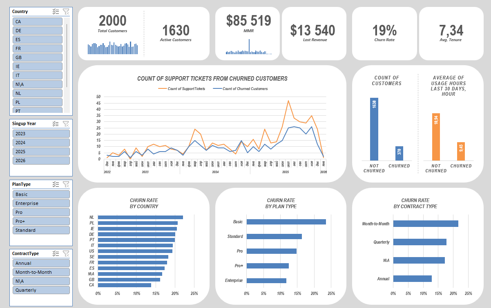
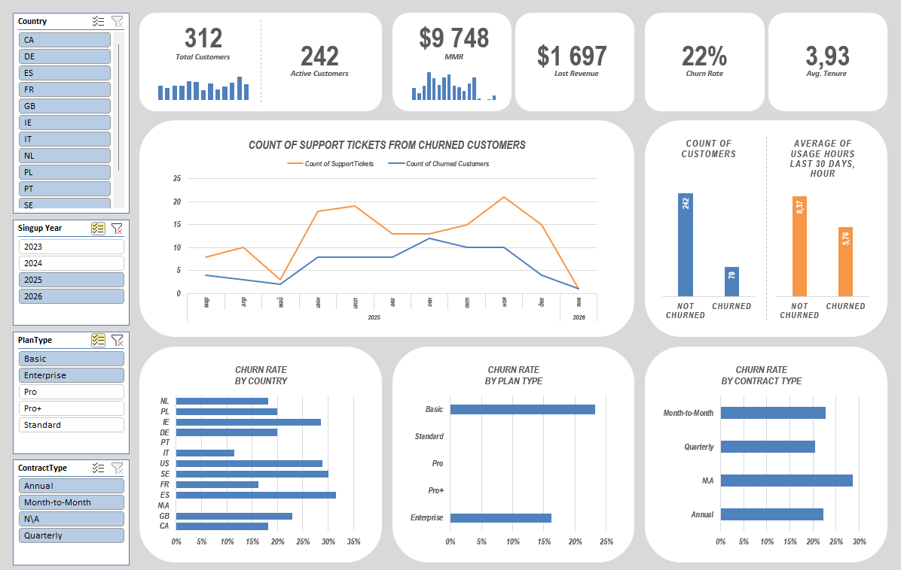

# Customer Churn Analysis (Excel + Power Query + Dashboard)

## Project Overview
This project analyzes customer churn for a subscription business using **Excel**, **Power Query**, and an interactive **dashboard**.
Goal: identify churn drivers and quantify revenue loss.

## Final Dashboard

  

## Filtered Dashboard

  

## Which segment gives the maximum churn?
Segments with the largest Churn: 
- Month-to-Month Contract (22%)
- Basic Plan (24%)
The most problematic segment:
Basic + Month-to-Month

## Is there a connection between usage and churn?
- Avg usage NOT churned = 10.94 hours
- Avg usage churned = 9.46 hours
There is a negative correlation between usage and churn: the lower the engagement, the higher the probability of churn.

## Is there a connection between support tickets and churn?
An increase in the number of support requests correlates with the growth of churn, which may indicate problems with the quality of the product or service.

## Which contracts are more profitable in terms of retention?
- The most profitable retention contract is the Annual one.
Long-term contracts demonstrate a higher level of customer retention.

## Raw Dataset
- `customers_raw.csv` 
- `subscriptions_raw.csv`
- `activity_raw.csv`

## Suggested Excel Workbook Structure
- `Customers`, `Subscriptions`, `Activity`, `FactCustomer` (Power Query outputs)
- `TotalCustomers`, `ActiveCustomers`, `ChurnRate`, `MRR`, `LostRevenue`, `AvgTenure`, `ChurnRatebyContractType`, `ChurnRatebyPlanType`, `ChurnbyCountry`, `UsagevsChurn`, `SupportTicketsvsChurn` (Indicators)
- `Dashboard`

## KPIs
- **Total Customers** = count(distinct CustomerId)
- **Active Customers** = customers with no EndDate
- **MRR** = sum(MonthlyFee) of active subscriptions
- **Lost Revenue (monthly)** = sum(MonthlyFee) of churned customers 
- **Churn Rate** = Churned Customers / Total Customers 
- **Avg. Tenure** = Average retention of outgoing customers

## What to include in this repo
- Final `.xlsx` dashboard in `/excel`
- Screenshots of dashboard, model, and Power Query steps in `/screenshots`
- Power Query transformation notes in `/docs/power_query_steps.md`
- Data Dictionary in `/docs/data_dictionary.md`